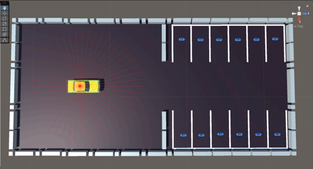
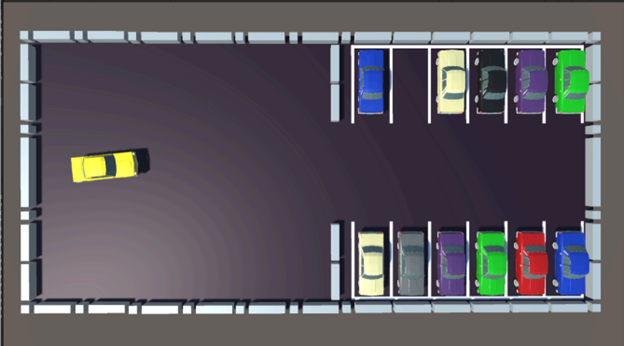

# Advanced reinforcement learning algorithm for precise car navigation and parking
This project focuses on applying advanced reinforcement learning (RL) algorithm, such as TD3, to a realistic modern problem: autonomous car parking. I developed a custom parking lot environment, incorporating sensors and physics-based interactions to simulate a highly realistic scenario. The use of advanced RL algorithm proved effective, as the agent demonstrated significant progress in learning within just a few episodes. In contrast, basic RL algorithms required significantly more episodes—up to ten times as many—to achieve a comparable level of learning. 

I worked on this as a part of our course project for CS5180 - Reinforcement Learning and Sequential Decision Making (Fall 2024) at Northeastern University, Boston.

## The Environment

The elements of the parking lots were created using Unity's built-in tools. For the cars, ready-made models from the “Low Poly Soviet Cars Pack” were used.

  

The parking lot environment is designed to include walls, parking lines, and designated parking spots. At the start of each episode, the car is placed at a random position and orientation in a large area outside the parking lot. To facilitate spatial awareness, the car is equipped with a Ray Perception Sensor mounted on top, which emits 50 rays in a 360-degree pattern. The environment consists of 12 parking spots, with 11 spots randomly occupied by parked cars, leaving one spot empty. The agent's objective is to identify and park in the empty spot during each episode.

  

## Agent training

The CarAgent begins each episode at a random position and orientation, introducing sufficient stochasticity to encourage exploration and learning across a diverse range of scenarios. Based on the rewards received at each step, the agent learns to navigate toward the empty parking spot using the specified reinforcement learning algorithm, optimizing its approach to achieve the task in the most efficient manner possible.

  

## State space, Action space and the Reward System:-

1. State Space
   - 50 Ray Perception Values
   - Current Torque
   - Current Steer Angle
   - Current Orientation
   - Current Position - X
   - Current Position - Y

2. Action Space
   - Torque
   - Steer Angle

3. Reward System
   - Proximity to Target
   - Alignment with Target
   - Smooth Driving
   - Stationary Penalty
   - Collision Penalty
   - Goal Rewards

## Algorithm used for neural network training:-

### TD3 (Twin Delayed Deep Deterministic Policy Gradient)

Twin Delayed Deep Deterministic Policy Gradient (TD3) is an advanced reinforcement learning algorithm that addresses overestimation bias in value function approximation. It improves upon DDPG using three key strategies:

1. Clipped Double Q-Learning: Two Critic networks independently estimate Q-values, and the minimum of the two is used as the target, reducing overestimation bias.
2. Target Policy Smoothing: Noise is added to the target Actor’s actions to avoid overfitting to Critic errors and ensure smoother updates.
3. Delayed Policy Updates: The Actor network is updated less frequently than the Critic networks, allowing the Critic to converge better before influencing the policy.

In this project, TD3 is used to train the agent for autonomous car parking. By leveraging these techniques, the algorithm enables efficient learning of throttle and steering actions, achieving robust performance in complex parking scenarios.

## "Scripts" folder consists of all C# and Python codes used to training the agent in the environment. 
C# code has Unity specific implementation whereas Python files include the TD3 neural network implementation.

